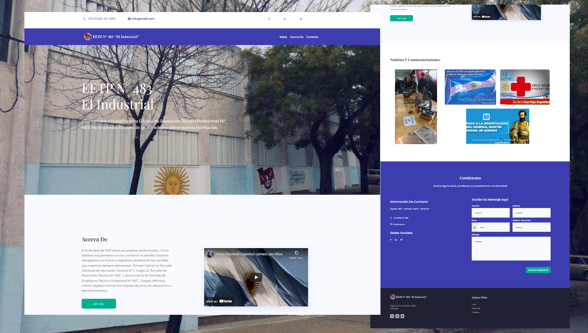

Yo Puedo Prgramar - Página Simple
--------------------------------------------------------

 

### Actividad integradora

 

Página simple creada con html, css y bootstrap

 
[Demo](https://pmarchionno.github.io/Pagina-Simple/)

La actividad integradora consiste en desarrollar una página web con todo lo aprendido, una vez finalizada será publicada en el mural de proyectos: http://miprimersitioweb.com.ar

 

El sitio a desarrollar debe incluir (como minimo): Una descripción sobre el tema elegido para desarrollar la página web.

Etiqueta title(modificando su contenido).

Etiqueta header.

Etiqueta de encabezado.

Etiquetas parrafos con contenido.

Una imagen.

Un video embebido desde youtube.

Etiqueta div

Etiqueta footer.

Un archivo CSS.

Utilizar una imagen (background-image) /color de fondo (background-color). Modificar tamaños (font-size) y colores de las fuentes (color) en alguna etiqueta Utilizar margin (margin) y alineaciones (text-align) en alguna etiqueta.

 

Preview
--------

